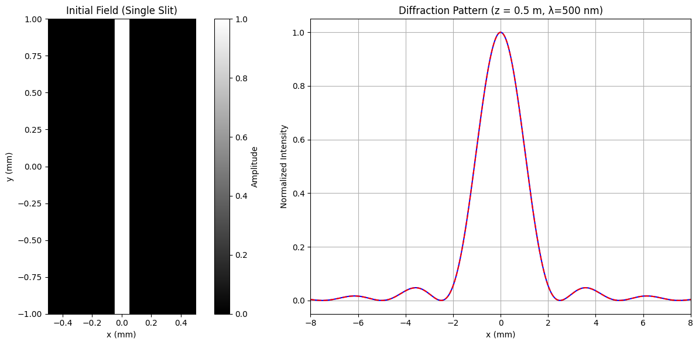
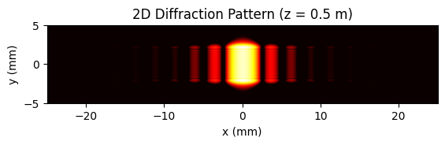
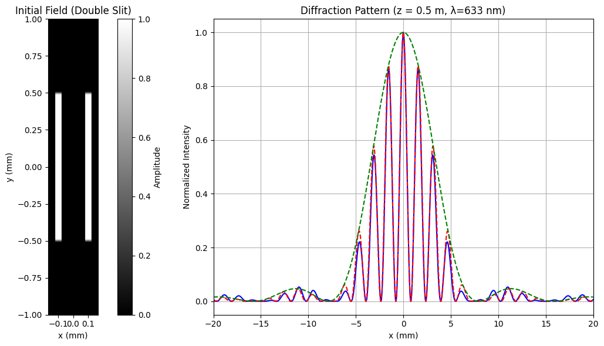
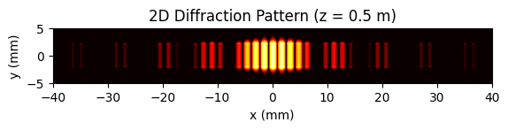
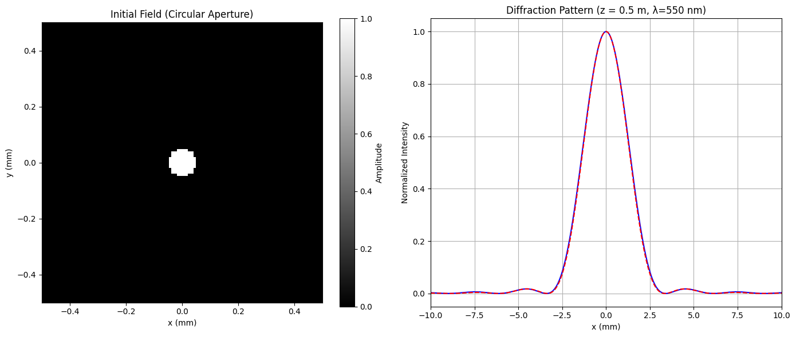
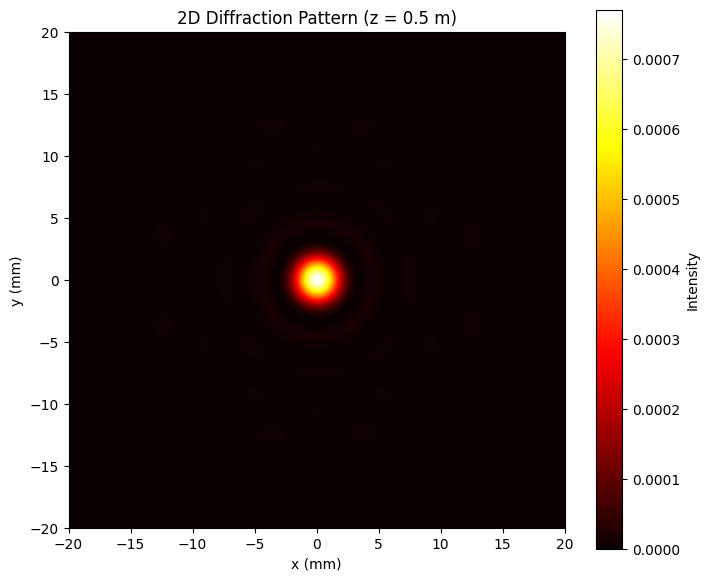

# LightPy
Evan Frangipane

## Introduction

LightPy is a project to simulate optics phenomena using the Angular
Spectrum Method (ASM). Currently, you can run single slit, double slit,
and circular aperture experiments. Also, I have the theoretical
intensity curves for comparison, and they seem to agree in certain
regions of parameter space.

## Python Requirements

I am using python 3.12 for development and running it seems like you
should have python \>= 3.10. There is a requirements.txt file that
contains the necessary python libraries. This file is very bloated
probably because of jupyter, so experts can install just the libraries
needed.

To produce a virtual environment with the necessary libs: On linux:

``` bash
python -m venv venv
source venv/bin/activate
pip install -r requirements.txt
```

On Windows:

``` bash
python -m venv venv
venv\Scripts\activate
pip install -r requirements.txt
```

## Parameters

You can play around with parameters with the json files in the config
folder. The single slit params file looks like this:

``` json
{
    "experiment_type": "single_slit",
    "simulation": {
        "wavelength_nm": 500,
        "Nx": 16000,
        "Ny": 480,
        "Lx_mm": 50.0,
        "Ly_mm": 10.0,
        "z_prop_m": 0.5
    },
    "aperture_params": {
        "width_um": 100.0,
        "height_mm": 5.0
    },
    "plot_limits": {
        "initial_field": {
            "xmin_mm": -0.5,
            "xmax_mm": 0.5,
            "ymin_mm": -1.0,
            "ymax_mm": 1.0
        },
        "diffraction_pattern_1d": {
            "xmin_mm": -8.0,
            "xmax_mm": 8.0
        },
        "diffraction_pattern_2d": {
            "xmin_mm": -10.0,
            "xmax_mm": 10.0,
            "ymin_mm": -5.0,
            "ymax_mm": 5.0
        }
    }
}
```

Nx and Ny are the number of pixels of the simulation, and Lx_mm, Ly_mm
are the lengths of the simulation. z_prop_m is the distance from the
aperture to the screen.

Plot limits is where you can change the plot limits of the three plots
that are currently produced when running the experiment.

## Validation

There is a validation check for three potential simulation issues:

Fresnel Number Check, Nyquist Criterion, and Wrap-Around Check

Running the validation will give a printout if the checks are passed and
what to do if not.

``` python
run_all_checks("single_slit_basic.json")
```

    --- Simulation Parameter Checks ---
    Fresnel Number (Fn): 0.0400
      -> Fraunhofer (far-field) approximation likely valid for theoretical comparison.

    Nyquist Criterion (Spatial Resolution):
      Max reliable distance (X): 40.13 mm
      Max reliable distance (Y): 6.00 mm
      Plotting range (X): +/- 10.00 mm
      Plotting range (Y): +/- 5.00 mm
      -> Pixel sizes (dx, dy) are adequate for the specified plot range.

    Wrap-Around Margin (Simulation Window Size):
      Current Lx: 50.00 mm, Ly: 10.00 mm
      Estimated Required Lx: 15.00 mm, Ly: 15.00 mm
      WARNING: Ly (10.00 mm) might be too small. Recommended Ly for wrap-around is at least 15.00 mm.
      -> Consider increasing Lx_mm and Ly_mm significantly.
    ---------------------------------

## Running the Simulation

To run the experiments there is a notebook called
running_experiments.ipynb in the notebooks folder that will get you
started. If you change the simulation files found in src then you will
have to restart the kernel and rerun the header code. Changing the
params files you can just rerun the experiments.

## Results

Here are the diffraction patterns that the simulation outputs (blue) and
comparison to theory (red dashed).









